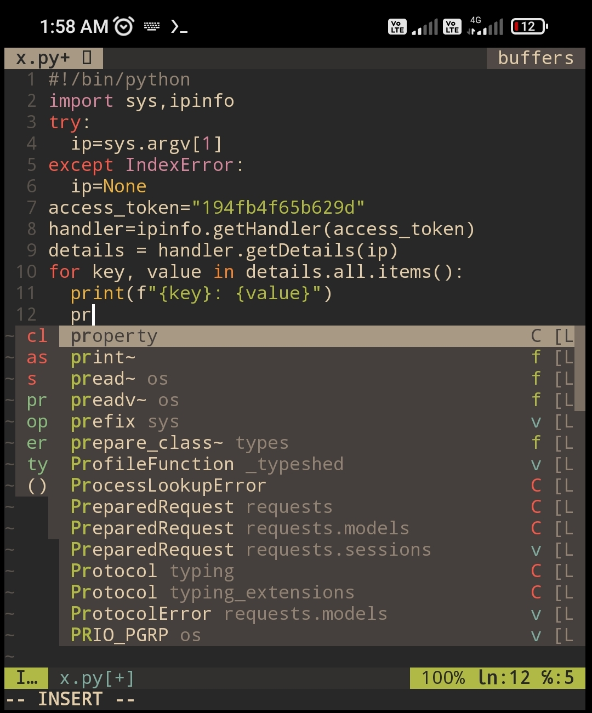

# NvimPythonIde
Python auto suggestion ide plugin installer for neovim...👽🦚..



# Installation

```
curl -sSL https://raw.githubusercontent.com/Anon4You/NvimPythonIde/main/InstallPlugin | bash
```

